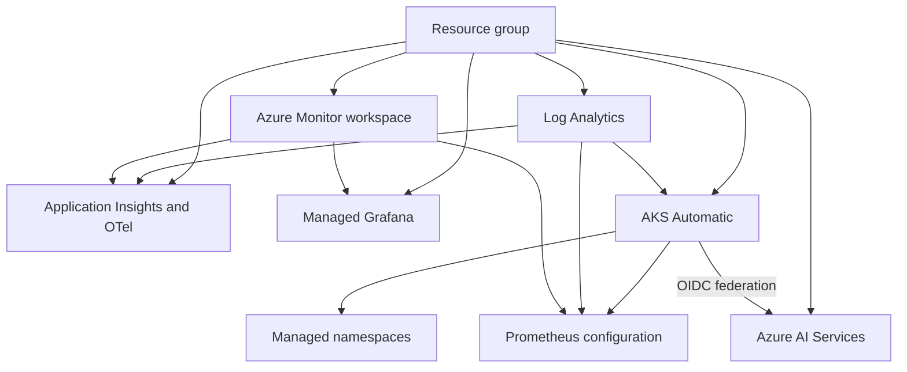

# AKS for Agents with HCP Terraform Stacks

This repository deploys a regional Azure platform for running AI agent workloads on AKS. HCP Terraform Stacks creates the same component graph in every configured Azure region and authenticates to Azure with short-lived OIDC tokens instead of client secrets.

The current `dev` deployment targets `westus3`.

## Architecture

For each entry in `regions`, the Stack creates:

| Component            | Resources and purpose                                                                                       |
| -------------------- | ----------------------------------------------------------------------------------------------------------- |
| `resource_group`     | Resource group named `rg-demo-*`                                                                            |
| `log_analytics`      | Log Analytics workspace                                                                                     |
| `monitor`            | Azure Monitor workspace                                                                                     |
| `otel`               | Application Insights resource configured for OpenTelemetry and Azure Monitor workspace ingestion            |
| `grafana`            | Azure Managed Grafana connected to the Azure Monitor workspace                                              |
| `aks_cluster`        | AKS Automatic cluster with Istio, Container Insights, managed Prometheus, and application monitoring        |
| `managed_namespaces` | AKS managed namespaces, namespace policy, quota, metadata, and namespace-scoped user RBAC                   |
| `prometheus`         | Data collection endpoints, rules, associations, and Prometheus recording rules                              |
| `foundry`            | Azure AI Services account, model deployment, managed identity, workload identity federation, and model RBAC |



Component dependencies are passed through Stack outputs. The component graph does not repeat Azure resource lookups.

## Namespace and identity model

`kubernetes_namespaces` is a map. Each map entry creates one managed namespace in every regional AKS cluster.

```hcl
kubernetes_namespaces = {
  demo = {
    name            = "demo"
    owner           = "paul"
    users           = ["00000000-0000-0000-0000-000000000000"]
    service_account = "demo"
  }

  platform = {
    name            = "platform"
    owner           = "platform-team"
    users           = ["11111111-1111-1111-1111-111111111111"]
    service_account = "platform-agent"

    network_policy = {
      ingress = "AllowAll"
      egress  = "AllowAll"
    }
  }
}
```

The map key is the stable Terraform instance key. `name` is the Kubernetes namespace name.

Each namespace supports:

| Property          | Required | Default or behavior                                                                               |
| ----------------- | -------- | ------------------------------------------------------------------------------------------------- |
| `name`            | Yes      | Managed namespace name                                                                            |
| `owner`           | Yes      | Added to the namespace annotations                                                                |
| `users`           | Yes      | Microsoft Entra object IDs assigned **Azure Kubernetes Service Namespace User** on this namespace |
| `service_account` | Yes      | Service account trusted by the Foundry workload identity                                          |
| `adoption_policy` | No       | `Always`                                                                                          |
| `delete_policy`   | No       | `Delete`                                                                                          |
| `network_policy`  | No       | Ingress and egress both use `AllowAll`                                                            |
| `resource_quota`  | No       | 2 CPU and 4 GiB request and limit defaults                                                        |

For every namespace, the Foundry component creates a federated identity credential with this subject:

```text
system:serviceaccount:<namespace>:<service-account>
```

All configured service accounts federate to the regional Foundry user-assigned managed identity. That identity has the **Cognitive Services OpenAI User** role on the regional Azure AI Services account.

`admin_principal_ids` is separate from namespace access. Each listed Microsoft Entra object ID receives:

- **Azure Kubernetes Service RBAC Cluster Admin** on each AKS cluster
- **Grafana Admin** on each Azure Managed Grafana instance
- **Cognitive Services OpenAI User** on each Azure AI Services account

Use Microsoft Entra object IDs, not application client IDs.

## Repository layout

| Path                         | Responsibility                                                                                                          |
| ---------------------------- | ----------------------------------------------------------------------------------------------------------------------- |
| `components.tfcomponent.hcl` | Instantiates and connects each regional component                                                                       |
| `providers.tfcomponent.hcl`  | Configures regional AzureRM and AzAPI providers with OIDC                                                               |
| `variables.tfcomponent.hcl`  | Defines the Stack input contract                                                                                        |
| `outputs.tfcomponent.hcl`    | Exposes regional deployment outputs                                                                                     |
| `deployments.tfdeploy.hcl`   | Defines the `dev` deployment and reads the `azure-dev` variable set                                                     |
| `setup_hcp/`                 | Bootstraps the Microsoft Entra application, service principal, role assignment, and HCP Terraform federated credentials |
| Component directories        | Conventional Terraform root modules used by the Stack                                                                   |

The provider versions are constrained to AzureRM `~> 5.1`, AzAPI `~> 2.12`, and Random `~> 3.9`. Terraform CLI `1.15.8` is pinned in `.terraform-version`.

## Prerequisites

You need:

- An Azure subscription with sufficient quota for AKS Automatic, Azure Managed Grafana, Azure Monitor, and the configured Azure AI model
- Permission to create a Microsoft Entra application and service principal
- Permission to assign Azure roles at the subscription scope used by `setup_hcp`
- An HCP Terraform organization, project, Stack, and project-scoped variable set
- Terraform CLI `1.15.8` for bootstrap and local validation

The Foundry module currently deploys:

| Setting       | Default          |
| ------------- | ---------------- |
| Model format  | `OpenAI`         |
| Model name    | `gpt-5.4-mini`   |
| Model version | `2026-03-17`     |
| SKU           | `GlobalStandard` |
| Capacity      | `200`            |

Confirm regional model availability and quota before applying.

The managed namespace resource uses the preview API version `2026-03-02-preview`. AzAPI schema validation is disabled for that resource because the local schema may not yet include the API version.

## Bootstrap HCP Terraform authentication

The `setup_hcp` directory creates:

- A Microsoft Entra application and service principal
- HCP Terraform plan and apply federated credentials
- An Azure role assignment for the service principal
- Outputs for the Azure tenant, subscription, and application client IDs

The current bootstrap configuration creates credentials for `dev`, `test`, and `production`. This repository currently defines only the `dev` deployment.

The current HCP Terraform project and Stack are both named `demo`. These values are configured in `setup_hcp/terraform.tfvars`. HCP Terraform names are case-sensitive and form part of the federated credential subject.

```shell
cd setup_hcp
terraform init
terraform plan
terraform apply
```

The bootstrap currently grants **Owner** at subscription scope. This permits the Stack to create resources and role assignments, but it is intentionally broad. Review and reduce this access before using the configuration outside a development environment.

After applying, record:

```text
client_id
subscription_id
tenant_id
```

## Configure HCP Terraform

Create a project-scoped variable set named `azure-dev` with category `env`. Add:

| Environment variable  | Value                                |
| --------------------- | ------------------------------------ |
| `ARM_CLIENT_ID`       | `setup_hcp` output `client_id`       |
| `ARM_SUBSCRIPTION_ID` | `setup_hcp` output `subscription_id` |
| `ARM_TENANT_ID`       | `setup_hcp` output `tenant_id`       |

`deployments.tfdeploy.hcl` reads these values through:

```hcl
store "varset" "dev" {
  name     = "azure-dev"
  category = "env"
}
```

The identity token and Azure identifiers are ephemeral Stack inputs. HCP Terraform exchanges the deployment token through the Microsoft Entra federated credentials created by `setup_hcp`.

## Configure the deployment

Edit the `deployment "dev"` inputs in `deployments.tfdeploy.hcl`:

```hcl
deployment "dev" {
  inputs = {
    identity_token = identity_token.azurerm.jwt

    regions = ["westus3"]

    client_id       = store.varset.dev.ARM_CLIENT_ID
    subscription_id = store.varset.dev.ARM_SUBSCRIPTION_ID
    tenant_id       = store.varset.dev.ARM_TENANT_ID

    admin_principal_ids = [
      "<microsoft-entra-object-id>",
    ]

    kubernetes_namespaces = {
      demo = {
        name            = "demo"
        owner           = "team-name"
        users           = ["<microsoft-entra-object-id>"]
        service_account = "demo"
      }
    }
  }

  destroy = false
}
```

Adding another region creates another complete component graph. Adding another namespace map entry creates that namespace, its user role assignments, and its Foundry federated identity credential in every configured region.

Set `destroy = true` only when you intend HCP Terraform to destroy the deployment.

## Validate locally

From the repository root:

```shell
terraform stacks init
terraform stacks providers-lock
terraform stacks fmt -check
terraform stacks validate
terraform fmt -recursive -check
```

These commands validate configuration and formatting. Plans and applies run through the HCP Terraform Stack.

## Deploy

1. Create an HCP Terraform Stack connected to this repository.
2. Set its configuration directory to the repository root.
3. Attach the project-scoped `azure-dev` variable set.
4. Push the configuration to the connected branch.
5. Start a run for the `dev` deployment.
6. Review the regions, model capacity, role assignments, namespace policies, and managed namespace preview resources.
7. Approve the apply.

## Outputs

All outputs are maps keyed by Azure region.

| Output                                    | Purpose                                                           |
| ----------------------------------------- | ----------------------------------------------------------------- |
| `otel_logs_endpoints`                     | OpenTelemetry logs ingestion endpoints                            |
| `otel_metrics_endpoints`                  | OpenTelemetry metrics ingestion endpoints                         |
| `application_insights_connection_strings` | Sensitive Application Insights connection strings                 |
| `application_insights_resource_ids`       | Application Insights resource IDs                                 |
| `azure_monitor_workspace_ids`             | Azure Monitor workspace IDs                                       |
| `log_analytics_workspace_ids`             | Log Analytics workspace IDs                                       |
| `aks_cluster_ids`                         | AKS cluster resource IDs                                          |
| `aks_cluster_names`                       | AKS cluster names                                                 |
| `foundry_openai_base_urls`                | Azure AI Services OpenAI v1 base URLs                             |
| `foundry_model_deployment_names`          | Model deployment names                                            |
| `foundry_account_ids`                     | Azure AI Services account resource IDs                            |
| `foundry_workload_identity_ids`           | Foundry user-assigned identity resource IDs                       |
| `foundry_workload_identity_client_ids`    | Client IDs used for workload identity service account annotations |
| `foundry_workload_identity_principal_ids` | Principal IDs used for Azure RBAC                                 |

## References

- [Terraform Stacks](https://developer.hashicorp.com/terraform/language/stacks)
- [Authenticate a Stack](https://developer.hashicorp.com/terraform/language/stacks/deploy/authenticate)
- [AzureRM provider authentication](https://registry.terraform.io/providers/hashicorp/azurerm/latest/docs#authenticating-to-azure)
- [AKS workload identity](https://learn.microsoft.com/azure/aks/workload-identity-overview)
- [AKS managed namespaces](https://learn.microsoft.com/azure/aks/managed-namespaces)
- [Azure OpenAI quotas and limits](https://learn.microsoft.com/azure/ai-foundry/openai/quotas-limits)
